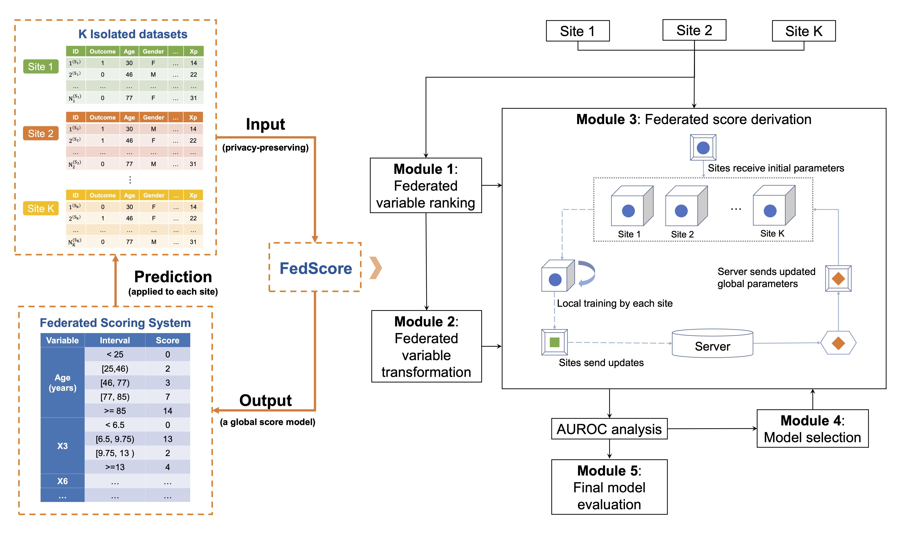

# FedScore-Python
FedScore is a framework for developing scoring systems across multiple sites in a privacy-preserving way. This repo contains the Python code for the proposed method. The R implementation is available [here](https://github.com/nliulab/FedScore).

See also our newly published [article](https://doi.org/10.1016/j.jbi.2023.104485) for the whole story.

### Introduction
Cross-institutional collaboration has gained popularity in recent years as a way to accelerate medical research and facilitate quality improvement. Federated learning (FL) can avoid data sharing by collectively training algorithms without exchanging patient-level data. However, most FL applications in medical image data use black box models from computer vision. Interpretable models, on the contrary, have fewer instances of FL applications despite their popularity in clinical research.

As a type of interpretable risk scoring model, scoring systems have been employed in practically every diagnostic area of medicine. However, scoring systems have usually been created using single-source data, limiting application at other sites if the development data has insufficient sample size or is not representative. Although it is possible to develop scoring systems on pooled data, the process of doing such pooling is time-consuming and difficult to achieve due to privacy restrictions.

To fill this gap, we propose FedScore, a first-of-its-kind framework for building federated scoring systems across multiple sites.

The figure below provides a high-level overview of the FedScore algorithm:



### System requirements
- Python 3.9
- To install required Python packages, run
```
pip install -r requirements.txt
```

### Test locally
- In `FedScore` directory, open three terminals. First start the server in the first terminal.
```
python server.py
```
- Then start two clients, one for each terminal.
```
python client1.py
python client2.py
```
